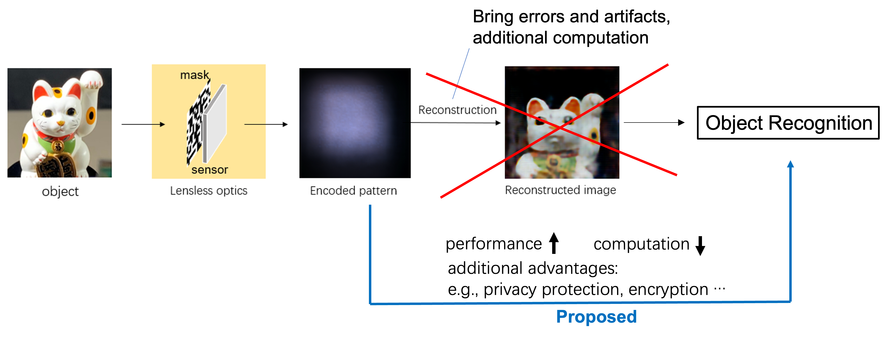

# LLI_Transformer

Transformer-based architecture for **reconstruction-free object recognition** on mask-based lensless optics. The model performs classification directly on the raw encoded sensor pattern, skipping image reconstruction entirely.

> Xiuxi Pan, Xiao Chen, Tomoya Nakamura, and Masahiro Yamaguchi.
> "Incoherent reconstruction-free object recognition with mask-based lensless optics and Transformer."
> *Optics Express* **29**(23), 37962–37978 (2021). [https://doi.org/10.1364/OE.443181](https://doi.org/10.1364/OE.443181)



## Highlights

- Recognizes objects directly from the encoded sensor pattern — no reconstruction step.
- Simplified Transformer with **separated convolutions** in the patchify stem and **axial attention** in the encoder for tractable training.
- Pretrained on simulated encoded patterns generated from ImageNet via the lensless forward model.

## Architecture


| Item              | Value     |
| ----------------- | --------- |
| Input size        | 224 × 224 |
| Patch size        | 16 × 16   |
| Encoder layers    | 12        |
| Attention heads   | 12        |
| Feature depth `D` | 768       |
| MLP inner depth   | 3072      |
| Parameters        | 8.3 M     |


See `lli_transformer/model.py` and `lli_transformer/modules.py`.

## Requirements

- Python 3.6.5
- PyTorch 1.7.1 + torchvision 0.8.2 (CUDA build)
- NVIDIA GPU (the paper used a Tesla V100 32 GB)

Install dependencies:

```bash
pip install -r requirements.txt
```

## Dataset preparation

Pretraining uses the **ILSVRC-2012 ImageNet** dataset. Download it and arrange:

```
imagenet2012/
├── train/<wnid>/*.JPEG
├── val/*.JPEG
└── imagenet_labels/
    ├── ILSVRC2012_validation_ground_truth.txt
    └── ILSVRC2012_mapping.txt
```

Then generate the filename/label `.npy` files used by the data loader:

```bash
python scripts/prepare_imagenet.py
```

Edit the `root_dir` constant inside the script to point at your local ImageNet directory.

## Training

1. Edit `configs/imagenet.yaml` to set the paths (`save_model_dir`, `load_model_dir`, `psf_dir`, `train_filename_dir`, `train_labels_dir`, `val_filename_dir`, `val_labels_dir`).
2. Choose visible GPUs via the standard environment variable, e.g.:
   ```bash
   CUDA_VISIBLE_DEVICES=0,1 python -m scripts.train
   ```

The training script uses `DataParallel`, so multiple GPUs are picked up automatically from `CUDA_VISIBLE_DEVICES`.

## Lensless hardware

The mask-based lensless camera used in the paper consists of:

- A 2.15 × 2.15 mm pseudorandom binary amplitude mask (40 × 40 µm aperture, fabricated by chromium deposition on synthetic-silica).
- A 6.41 MP CMOS image sensor (Sony IMX178, 2.4 µm pixel pitch).
- Mask-to-sensor separation: 2.5 mm.
- PSF captured by illuminating the mask with a 1 mm-diameter point LED placed 15 cm away.

Capture scripts live under `scripts/data_collection/`.

## Results


| Dataset       | Accuracy | ROC AUC |
| ------------- | -------- | ------- |
| Fashion MNIST | 91.47 %  | —       |
| Cats-vs-dogs  | 94.26 %  | 96.64 % |


See Table 3 of the paper for the full comparison against lensed-camera and reconstruction-based baselines.

## Citation

```bibtex
@article{pan2021lli,
  author    = {Xiuxi Pan and Xiao Chen and Tomoya Nakamura and Masahiro Yamaguchi},
  title     = {Incoherent reconstruction-free object recognition with mask-based lensless optics and Transformer},
  journal   = {Optics Express},
  volume    = {29},
  number    = {23},
  pages     = {37962--37978},
  year      = {2021},
  doi       = {10.1364/OE.443181}
}
```

## License

MIT — see [LICENSE](./LICENSE).